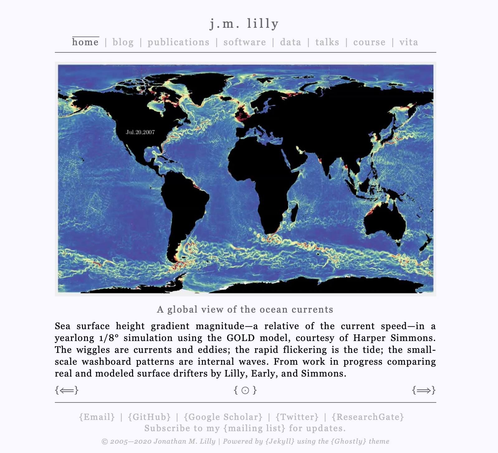

# Ghostly
## Introducing Ghostly, a personal web site theme using Jekyll

Ghostly is a blog-enabled, text-centered Jekyll theme with a minimal aesthetic and fade transitions, intended to meet the needs of academic researchers.  This theme comes equipped with a double blog, a lightbox, support for online commenting, and a skeleton site with a readily customizable style.

Ghostly is what I use for my own web site, [jmlilly.net](http://www.jmlilly.net/), and is available for download from [GitHub](https://github.com/jonathanlilly/ghostly).  You could probably modify it into a fully functioning web site for yourself in a matter of hours.  



## History

In early prehistory, before phones and tablets, you could build your own web site from scratch.  The result was simple and ugly.  Then CSS emerged in all its unwieldy beauty, engendering equal parts hope and despair.

Devices proliferated, more revolutions occurred, and things got really complicated.  Nowadays you can have someone else do the under-the-hood work with Wordpress, or build a site yourself with a full-featured framework such as Bootstrap.  In either case you're mostly stuck with somebody else's templates.

When I was updating my own web site, I didn't want it to look like anyone else's.  I also didn't want a "flavor of the month" site using whatever is the newest fad, because everyone uses those and then they all look outdated in a year when the next thing comes around. I was looking to create something simple, something that I could manage myself, and that would appear to be outside of time.

Around this time I was inspired also by a quote from the musician Jack White, describing in the movie _It Might Get Loud_ the experience of seeing as a youth a radically minimal rock band perform:

>I went and saw him play, and was blown away.  There was nothing, there was nothing there.
Just a little amp and a Silverstone guitar, heading in what I would have thought of at the time as a backwards direction.
I had to reassess what backwards meant.

This reminded me of a colleague who continues to program in F77 and read his email in Pine, just like the ancient Egyptians, because those tools are sufficient for his needs.  It made me realize there can be something futuristic about intentionally choosing retro.

So I built myself a web site using only HTML and CSS and a little bit of Javascript, all already antiquated tools at that time.   

Fast forward a decade or so, and my simple web site fortunately still garners appreciation from colleagues and friends for its elegance.  However, it is lacking in important functionality that I have long desired, namely support for a blog.

Recently I took some time to revamp and extend my web site, using the Jekyll static site generating framework.  In addition to supporting blog posts, it is also much easier to update and modify, as  described shortly.  This updated site was encapsulated into a Jekyll theme in case anyone else would like to make use of it.

## A little bit about Jekyll

Jekyll is a static site generator, meaning that you start out with the pieces of a web site, assemble it using Jekyll's automation, and post the result to your own server or push changes to GitHub.  You don't need to have any special software running on the host server.

The way Jekyll handles blogs is different from the database-driven approach you might be familiar with.  Here there is no database.  You write your posts as simple Markdown files, build the site with Jekyll, then push the changes.  Functionality for searching through or sorting the blog posts can also be implemented, although I'm currently not do so in Ghostly.

Jekyll is written in Ruby, though you don't have to know any Ruby to use it.  Instead Jekyll combines the power of three different simple languages: Markdown, SCSS, and Liquid.

*  [Markdown](https://kramdown.gettalong.org/quickref.html)  is a very simple markup language for effortlessly composing marked-up text.  This is how you write most of your content in Jekyll, e.g. blog posts.  
*  [SCSS](https://sass-lang.com/documentation/syntax/), or "Sassy CSS", is an extension of CSS that includes support for handy features such as variable definitions, e.g. "`$textfont: Georgia`".  This gives you flexible control over the style of your site.
*  [Liquid](https://shopify.github.io/liquid/) is a templating language that provides a rich set of logic and control options for creating your static web site from its pieces.

In Jekyll, you define page _templates_ which are a mixture of HTML and Liquid.  Individual pages are written in Markdown mixed with HTML and Liquid.  Pages contain your content, while templates control the site structure and layout and are considered part of the theme. Styles are written in SCSS, a superset of CSS.

Jekyll processes the Liquid logic, converts the Markdown into its HTML equivalent, pushes the content from the pages into the appropriate templates, converts the SCSS into standard CSS, and builds you a web site that appears to have been written exclusively in HTML and CSS.  

You can probably see now why Jekyll is referred to as a "static site generator".

This may seem like a lot of work to generate something we could have coded by hand.  However, if you've ever wanted to, say, change the header or footer on a half-dozen web pages, you begin to understand why a static site generator has some appeal.  

If we're going to build a site with a lot of moving parts, such as a blog, then inserting all the content by hand begins to feel very cumbersome.

## Markdown

One of the best things about Jekyll is that you can write most of your content in Markdown.  For example, two of my publication references are written as

```markdown
1.  Lilly, J. M., A. M. Sykulski, J. J. Early, and S. C. Olhede (2017). Fractional Brownian motion, the Matérn process, and stochastic modeling of turbulent dispersion. _Nonlinear Processes in Geophysics_, **24**: 481–514. [doi 10.5194/npg-24-481-2017](https://doi.org/10.5194/npg-24-481-2017)
1.  Lilly, J. M. (2018). Kinematics of a fluid ellipse in a linear flow. _Fluids_, **3** (1): 1–29. [doi 10.3390/fluids3010016](http://doi.org/10.3390/fluids3010016)
```

which are then converted by Jekyll into HTML to yield

```html
<ol>
  <li>Lilly, J. M., A. M. Sykulski, J. J. Early, and S. C. Olhede (2017). Fractional Brownian motion, the Matérn process, and stochastic modeling of turbulent dispersion. <em>Nonlinear Processes in Geophysics</em>, <strong>24</strong>: 481–514. <a href="https://doi.org/10.5194/npg-24-481-2017">doi 10.5194/npg-24-481-2017</a></li>
  <li>Lilly, J. M. (2018). Kinematics of a fluid ellipse in a linear flow. <em>Fluids</em>, <strong>3</strong> (1): 1–29. <a href="http://doi.org/10.3390/fluids3010016">doi 10.3390/fluids3010016</a></li>
</ol>
```

As you can see, writing links, marking up text, and indicating a list element are all easier and more readable in Markdown.  Finally the HTML is rendered in the browser as

1.  Lilly, J. M., A. M. Sykulski, J. J. Early, and S. C. Olhede (2017). Fractional Brownian motion, the Matérn process, and stochastic modeling of turbulent dispersion. _Nonlinear Processes in Geophysics_, **24**: 481–514. [doi 10.5194/npg-24-481-2017](https://doi.org/10.5194/npg-24-481-2017)
2.  Lilly, J. M. (2018). Kinematics of a fluid ellipse in a linear flow. _Fluids_, **3** (1): 1–29. [doi 10.3390/fluids3010016](http://doi.org/10.3390/fluids3010016)

after applying any CSS styling.  If you're viewing this on my web site, you'll see that link texts have been wrapped curly braces, {}, a Ghostly stylistic choice that results from a Javascript call.

A handy feature of lists in Markdown is that the numbers used to denote the list are irrelevant.  In other words, a list containing items all denoted by "1." leads to "1.", "2.", "3.", etc. Thus, you don't have to renumber your list if an item is added or removed.

The particular dialect of Markdown that is used with Jekyll is called [kramdown](https://kramdown.gettalong.org/quickref.html).  In addition to its basic features, kramdown supports [extended features](https://kramdown.gettalong.org/syntax.html) such as the useful ability to specify an the class of the resulting HTML object with the `{: .class}` notation.

Further details of Jekyll and its component languages are well handled in  the [documentation](https://jekyllrb.com/docs/), particularly the [tutorial](https://jekyllrb.com/docs/step-by-step/01-setup/), and in documents referred to therein.  We turn now to describing the Ghostly theme.

<!--[Theme preview](https://jekyll.github.io/minima/)
-->

## Installation

### Installing with a skeleton site

The easiest way to get started with Ghostly is with a skeleton version of my web site that you can edit and customize.

Download Ghostly from [GitHub](https://github.com/jonathanlilly/ghostly), rename the directory to "`ghostly`", and place this directory into an otherwise empty base directory.  Then copy the contents of the subdirectory "`/ghostly/skeleton`" into the top-level base directory.

Next run "`gem install jekyll bundler`", followed by "`bundle install`" from within the base directory to install any missing gems. Jekyll is expecting this directory to be a git repository, so also type "`git init`" to prevent Jekyll from complaining.  Finally
```ruby
bundle exec jekyll serve --trace
```
runs a bare-bones copy of my site that you can view in your browser at the address http://localhost:4000/.

In your base directory you will find two configuration files.  The first, called "`Gemfile`", tells Ruby which gems (Ruby parlance for packages) are required.  You will find the line
```ruby
gem "ghostly", path: './ghostly'  
```
in the `Gemfile`, stating that the Ghostly theme is located in the same directory that contains the `Gemfile`.
The second is called "`_config.yml`" and has essential configuration information for Jekyll itself.  This file has the important line
```yaml
exclude:
   - ghostly/skeleton
```
which prevents Jekyll from trying to process the example files stored in the skeleton directory.  Both of these files will be discussed in more detail shortly.

### Installing from a Gemfile

Alternatively to the above steps, you could follow the [instructions](https://jekyllrb.com/docs/) for creating a new Jekyll site, and then [swap out](https://jekyllrb.com/docs/themes/#installing-a-theme) the default Minima theme for Ghostly by installing the Ghostly gem.  Honestly, however, this is going to be a lot more cumbersome.  To begin with, you will not have a working template because Ghostly is expecting a set of Markdown pages (publications, vita, etc.) that are not present in the default Jekyll installation.  

Moreover, you will not be able to modify the Ghostly theme files unless you also follow [these additional steps](https://jekyllrb.com/docs/themes/#converting-gem-based-themes-to-regular-themes).  For some reason Jekyll thinks it is a good idea, upon installing a gem-based theme, to hide the theme files in an obscure location.  Personally, I think you are going to want to have these available to read if not to modify.

If you do choose this route, you'll still need to find the  `_plugins` directory that is located in `skeleton` and copy it to the base directory containing the project.  This is because Ruby is expecting plugins to be located in the base directory and not inside the theme, and I was not able to figure out a way to package this needed plugin together with the theme.  

## Customizing Ghostly

Before continuing you'll need to know a little bit about Jekyll.  At a minimum, I'd recommend reading the   [tutorial](https://jekyllrb.com/docs/step-by-step/01-setup/) and familiarizing yourself with Jekyll's
[order of operations](https://jekyllrb.com/tutorials/orderofinterpretation/)
and [directory structure](https://jekyllrb.com/docs/structure/).  I'd also recommend the Readme for Jekyll's default [Minima](https://github.com/jekyll/minima/blob/master/README.md) theme, keeping in mind that there are some differences with Ghostly.  This should be enough to get you started.

The `_config.yml` file in your base directory contains the following information, in the form of key-value pairs:
```yaml
title: j.m. lilly
author: Jonathan M. Lilly
description: >- # this means to ignore newlines until "baseurl:"
  The research website of Jonathan M. Lilly.
baseurl: "" # the subpath of your site, e.g. /blog
url: "http://jmlilly.net" # the base hostname & protocol for your site

# The order to list your pages in the nav bar, separated by single spaces
# The first element is whatever you would like index.html to be called
# All others refer to files with the ".md" extension in your base directory
pageorder: "home blog publications software data talks course vita"
# The order to list social media in the footer, separated by single spaces
socialorder: "email github googlescholar twitter researchgate"

# Contact and social media information ... comment out what you don't have
email: eponym@jmlilly.net
twitter_username: jmlilly
github_username:  jonathanlilly
researchgate_username: Jonathan_Lilly
googlescholar_id: os-j4rIAAAAJ
# Find this from your Google Scholar address, after "user=" and before the "&"
# e.g. https://scholar.google.com/citations?user=os-j4rIAAAAJ&hl=en
mailchimp_username: jmlilly #Whatver you log in with
mailchimp_user_id: 5c78995e12e1229e3cf788002
mailchimp_audience_id: b3df7d8423  
# To find your mailchimp IDs is to go to Create > Signup Form > Embedded Form,
# then look for a string like u=5c78995e12e1229e3cf788002&amp;id=b3df7d8423
# Your user ID is between "u=" and "&amp", and the audience ID is after "id="
# If the form doesn't work, compare your code with that in mailchimp.html
commentbox_id: 5640936277147648-proj

# Theme specifications
theme: ghostly
ghostly:
  date_format: "%B %-d, %Y" # Corresponds to e.g. January 1, 2020
  # see http://shopify.github.io/liquid/filters/date/ for customization
  backbutton: <a href="javascript:history.back()">{&xlarr; Back}</a>
  morebutton: "&xrarr;" # Styling for back and more buttons respectively
  linkwrapping: true #Enable default Ghostly behavior of wrapping
  # html links in braces {} and others (e.g. to pdfs) in brackets []
  blogsymbol: <span>&xodot;</span> # Symbol to return from post to blog page
  # Note that in the above html code, no spaces are allow around the ":"s
  itemseparator: "|" # Symbol to separate items in horizontal lists

# Enable Google Analytics
# See https://support.google.com/analytics/answer/1008080?hl=en to find your ID
google_analytics: UA-361324-2

# Location the site is to be built. The source can't be inside the destination
destination: ../site  #Build into a directory at the same level as the source

# Files or directories inside the destination that you don't want to clobber
keep_files: [Readme.md, course, doc, figures, images, papers, talks, videos, .gitignore]

##################################################################
# The following values won't need to be changed unless you modify Ghostly

# Set kramdown to globally parse within html tags
# See https://kramdown.gettalong.org/syntax.html
kramdown:
    parse_block_html: true    

plugins:
  - jekyll-feed # For generating a feed of blog posts
  - jekyll-seo-tag #For search engine optimization
  # See https://github.com/jekyll/jekyll-seo-tag/blob/master/docs/usage.md and
  # https://github.com/jekyll/jekyll-seo-tag/blob/master/docs/advanced-usage.md

# Exclude from processing
exclude:
   - minima
   - ghostly/skeleton
```
{: .small}

You're obviously going to want to edit the values in this file.  In addition to your personal information, some style and build options are also specified herein.

The other files in your base directory all have the extension "`.md`" and will contain the primary content of your web pages.  In the skeleton setup, these are the home page, `index.md`, together with

> `blog.md`, `course.md`, `data.md`, `publications.md`, `software.md`, `talks.md`, `vita.md`

the names of which appear in the navigation bar in the order specified in the `pageorder` variable defined above in `_config.yml`.  

If you would like your site to be composed of other files, just create new Markdown files, e.g. `research.md`, including a front matter header as in the other files.  Then modify `pageorder` to set the order for your navigation bar.

The "`linkwrapping`" variable here sets the default Ghostly style to wrap HTML links in curly braces, {}, and other types of links (e.g. to downloads) in square brackets, []. This effect can be disabled by setting the variable to false.  

Another place you may want to edit in order to customize things is the top-level style file, `ghostly/sass/ghostly.scss`.  It's worth looking at this file.


```scss
// CSS for the Ghostly Jekyll theme by J.M. Lilly
// See /ghostly/_base.scss for the rest

@charset "utf-8";

// Overall width of the site
$textwidth: 40em;

// Text alignment centered
$headeralign:center; $footeralign:center; $bodyalign:justify; $figtitlealign: center;

// Text alignment leftish
//$headeralign:left; $footeralign: center; $bodyalign:left; $figtitlealign: left;

// The ghostly color scheme
$background:#F8F8FF; $linkcolor:#666666; $deemphasis:#B8B8B8; $accent:#33AA99;

// The oceanic color scheme
//$background:#FCF9FF; $linkcolor:#336699; $deemphasis:#FF9700; $accent:#33AA99;

// Fonts
$textfont:Georgia; $codefont:Courier;

//Letter spacing
$normal:0.06em; $wide:0.1em; $verywide:0.2em;

// Text for title and nav
$titlesize: x-large; $titletransform: lowercase;
$navsize: large; $navtransform: lowercase; $activenav: overline;

// Import partials
@import
  "ghostly/normalize", // css normalize and reset thanks to Elad Shechter, see
  "ghostly/reset", // https://medium.com/@elad/normalize-css-or-css-reset-9d75175c5d1e
  "ghostly/github",  // Syntax highlighting using the Github color scheme
  "ghostly/lightbox", // Styling for the lightbox package by Lokesh Dhakar
  "ghostly/base" // Base styling is last as it overrides some of the others
;

// github.scss is created with rougify style github > _github.scss
// See https://bnhr.xyz/2017/03/25/add-syntax-highlighting-to-your-jekyll-site-with-rouge.html
// See https://spsarolkar.github.io/rouge-theme-preview/ for more syntax themes
```
{: .small}

Variables such as `$textwidth` set the overall properites of the site.  For example, uncommenting the Oceanic color scheme and leftish text alignment, and setting "`linkwrapping: false`" in the file `_config.yml`, gives a different look to the site.  

This file sets parameters for the main styling, while the included partials handle the details.  These live in the directory `ghostly/sass/ghostly` and all have names beginning with an underscore, though the underscores are not needed in the import statement.

For example,  `_github.scss` is in particular for highlighting code syntax; this can be swapped out for another style as described below.

Nearly all the styling is accomplished in `_base.scss`, so you'll want to edit that if you want to substantially modify the styling.

---

## Special features in Ghostly

### A double blog

The most substantial feature of Ghostly is a double blog.  There is a blog on the home page, intended for short posts such as research announcements, press releases, etc.  A second blog, under `blog`, is for longer pieces of writing.  

These two blogs are implemented through the use of categories.  A post you would like to have show up on the home page has "`categories: homepage`" in its front matter.   A post that you would like to have show up on the blog has "`categories: blog`" in its front matter.  

Then, a [Jekyll plugin](https://ajclarkson.co.uk/blog/jekyll-category-post-navigation) by A. J. Clarkson for navigating through all the posts in a particular category---a functionality Jekyll is lacking out of the box---is employed to keep the two sets of posts separate.  The navigation is set to loop around, crossing from the last post back to the beginning and vice-versa.

You could of course easily disable the home page blog if you prefer to have static content.

Jekyll has two ways of keeping track of posts, [categories and tags](https://jekyllrb.com/docs/posts/#categories-and-tags). Since the categories are here employed to implement the double blog, it would be better to use tags for your organization.  If you happen to need to use multiple categories on the same posts, make sure that either "`blog`" or "`homepage`" is the first category listed.  Labelling the same post both "`homepage`" and "`blog`", in order to have the same post showing up in two different places, won't work with the way the double blog is implemented.

### Commenting via CommentBox

Ghostly supports commenting via [CommentBox](https://commentbox.io).  I chose this provider because, of the [many](https://darekkay.com/blog/static-site-comments/) third-party comment providers, CommentBox has both a very professional-looking presentation as well as a free tier.

To use CommentBox, you need to sign up and place your ID in the "`commentbox_id:`" line in the `_config.yml`.  Then for any page or post you would like to enable comments on, simply place the line "`commentbox: true`" in the front matter.  

### Image galleries with Lightbox

Ghostly also comes with a convenient package for making beautiful pop-up images galleries, [Lightbox v2.11.1](http://lokeshdhakar.com/projects/lightbox2/) by Lokesh Dhakar.  See `data.md` in the skeleton for an example of its usage, which is then rendered as the gallery at [jmlilly.net/data](http://jmlilly.net/data).  To enable Lightbox on a page or post, again just place ""`lightbox: true`" in the front matter.

### Syntax highlighting

Jekyll automatically highlights the syntax of code snippets.  Various color schemes can be chosen, and Ghostly uses a highlighting theme called GitHub.

Different themes can be previewed [here](https://spsarolkar.github.io/rouge-theme-preview/).  You can create a style file corresponding to these themes by following [these instructions](https://bnhr.xyz/2017/03/25/add-syntax-highlighting-to-your-jekyll-site-with-rouge.html), which can then be placed into the directory `ghostly/sass/ghostly` and imported into the main style file `ghostly/sass/ghostly.scss` instead of `_github.scss`.

### Search engine optimization

Finally Jekyll, like the default Minima theme, comes with the [jekyll-seo-tag](https://github.com/jekyll/jekyll-seo-tag) plugin for search engine optimization.  Read [this](https://github.com/jekyll/jekyll-seo-tag#usage) to learn how to set it up.

---

## Includes

Ghostly includes [jQuery v3.4.1](https://github.com/jquery/jquery) by the JS Foundation and other contributors, [Lightbox v2.11.1](http://lokeshdhakar.com/projects/lightbox2/) by Lokesh Dhakar, and [normalize.css](https://github.com/necolas/normalize.css) by Nicolas Gallagher and Jonathan Neal, all of which are released under the terms of the MIT license, as well as an unlicensed [Jekyll plugin](https://ajclarkson.co.uk/blog/jekyll-category-post-navigation) by A. J. Clarkson modified by myself.

---

## License and contact

This theme is available as open source under the terms of the [MIT License](http://opensource.org/licenses/MIT).

Ghostly is hosted at [GitHub](https://github.com/jonathanlilly/ghostly) where you are welcome to report bugs, fork, contribute, etc. Feel free to alteratively contact me at eponym@jmlilly.net with any comments or questions.  
